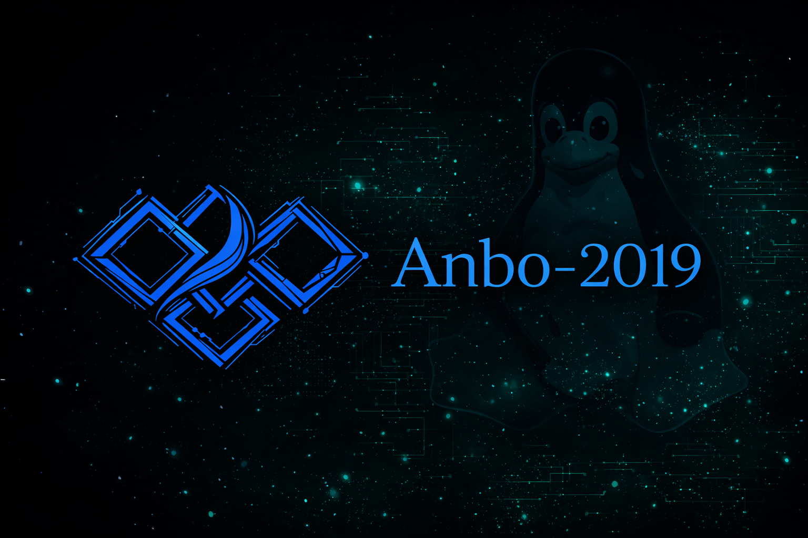

<div align="center">

<!-- BANNER - Reemplaza esta URL con tu imagen banner -->


</div>

---

<div align="center">

### 🙋‍♂️ Sobre mí

</div>


```yaml
nombre:    "Adanies Basilio"
ubicacion: "Colombia 🤠🌎"
rol:       "Full Stack Developer"
estado:    "Siempre aprendiendo..."
```

- 🚀 Apasionado por el desarrollo de software
- 💼 Trabajo con tecnologías **web**, **backend** y **bases de datos**
- 🌱 Actualmente aprendiendo nuevas tecnologías
- ⚡ Me encanta resolver problemas con logica y de dicación
- 📫 Contáctame: **adaniesbasilio@gmail.com**

<br clear="right"/>

---

<div align="center">

### 🛠️ Mis Tecnologías & Herramientas

</div>

#### 🌐 Frontend

<div align="center">


</div>

#### ⚙️ Backend

<div align="center">


</div>

#### 🗄️ Base de Datos

<div align="center">


</div>

#### 🔧 Herramientas & Entornos

<div align="center">


</div>

#### 📐 Pseudocódigo & Lógica

<div align="center">


</div>

---

<div align="center">

### 📊 Estadísticas de GitHub


</div>

<div align="center">


</div>

---

<div align="center">

### 🌐 Conéctate conmigo

[](hhttps://www.linkedin.com/in/adanies-basilio-49251a3b2/)
[](https://www.youtube.com/@anbominecom)
[](https://www.instagram.com/anbo_minecon/)
[](mailto:adaniesbasilio@gmail.com)

</div>

---

<div align="center">


*⭐ Si te gusta mi trabajo, no olvides dejar una estrella en mis repos ⭐*

</div>
